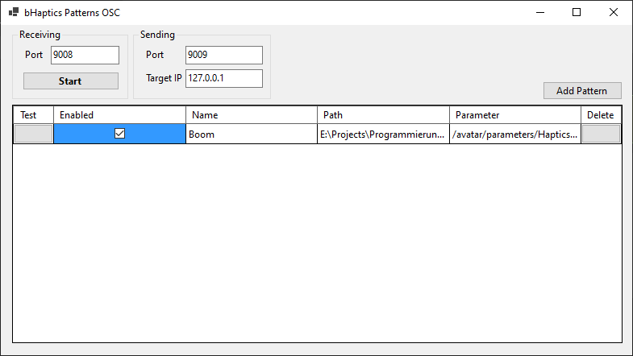

# OSC Haptic Pattern Trigger

A simple app to map bHaptics Designer files to OSC parameters (to be called by programs like VRChat)

## Limitations

* The app currently only accepts boolean values which are reset to `false` once the signal has been received.
* It is not yet possible to add parameters (like intensity or offsets) to imported patterns.
* The UI is a bit barebones
